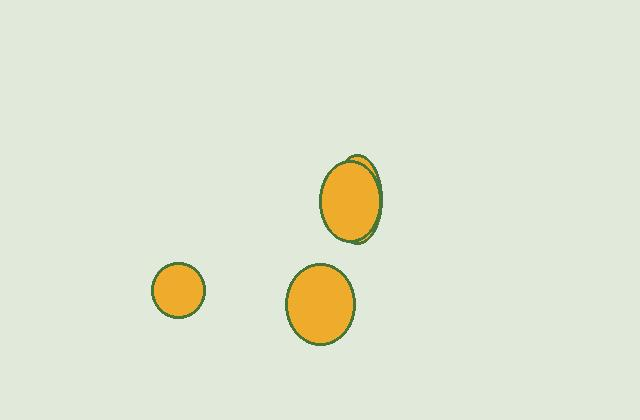
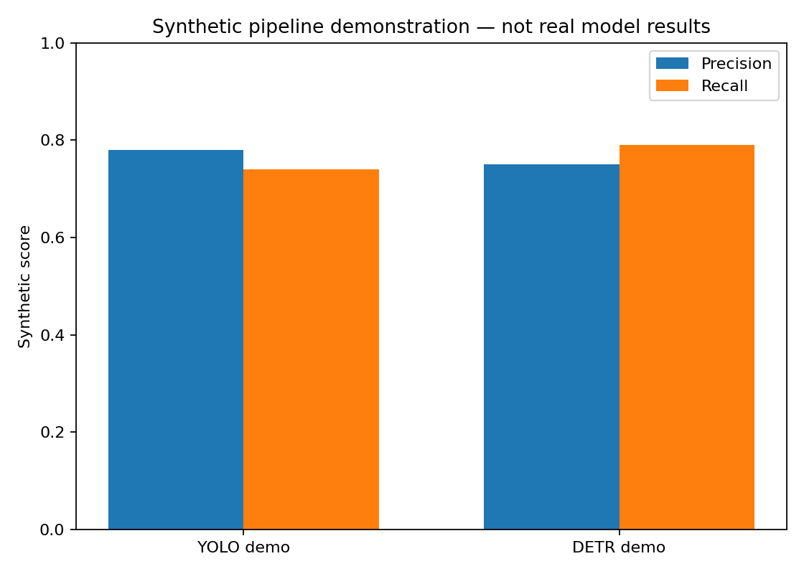

# Mango Detection with YOLO and DETR

A reproducible portfolio structure for comparing a one-stage YOLO detector with a Transformer-based DETR detector on annotated orchard images.

## What this repository demonstrates

- YOLO-format dataset validation
- Synthetic demo dataset generation for safe local testing
- Config-driven YOLO training entry point
- DETR preparation notes and training scaffold
- Prediction visualisation
- Evaluation-report structure for mAP, precision, and recall
- Automated lightweight tests that do not require model downloads

## Important data and results statement

The original portfolio describes a project with **1,730 annotated images**, split into **1,384 training, 260 validation, and 86 test images**. That original dataset and trained weights are not included here. Do not add those images unless you have the right to publish them.

The included `create_demo_dataset.py` makes a tiny synthetic dataset solely to prove the folder structure and validation code. It is not evidence of real orchard performance.

## Quick start without deep-learning downloads

```bash
python -m venv .venv
.venv\Scripts\activate
pip install -r requirements-lite.txt
python src/create_demo_dataset.py
python src/validate_dataset.py --config configs/demo_dataset.yaml
python src/demo_evaluation.py
python -m unittest discover -s tests
```

## Synthetic pipeline preview

The following images are explicitly synthetic and exist only to demonstrate the repository workflow.





## YOLO training

Install the full dependencies and point `configs/dataset.yaml` to a dataset you are legally allowed to use:

```bash
pip install -r requirements-full.txt
python src/train_yolo.py --data configs/dataset.yaml --epochs 50 --model yolo11n.pt
```

## DETR training

`src/train_detr.py` is a transparent scaffold that checks for the required packages and dataset paths. Complete the dataset adapter only after selecting the actual COCO-style annotation source.

## Expected repository evidence

Before pinning this repository, add:

- One screenshot of the annotation format
- One training-results chart from a run you performed
- Two prediction images
- A metric table containing only verified values
- A brief comparison of accuracy, speed, and compute requirements
